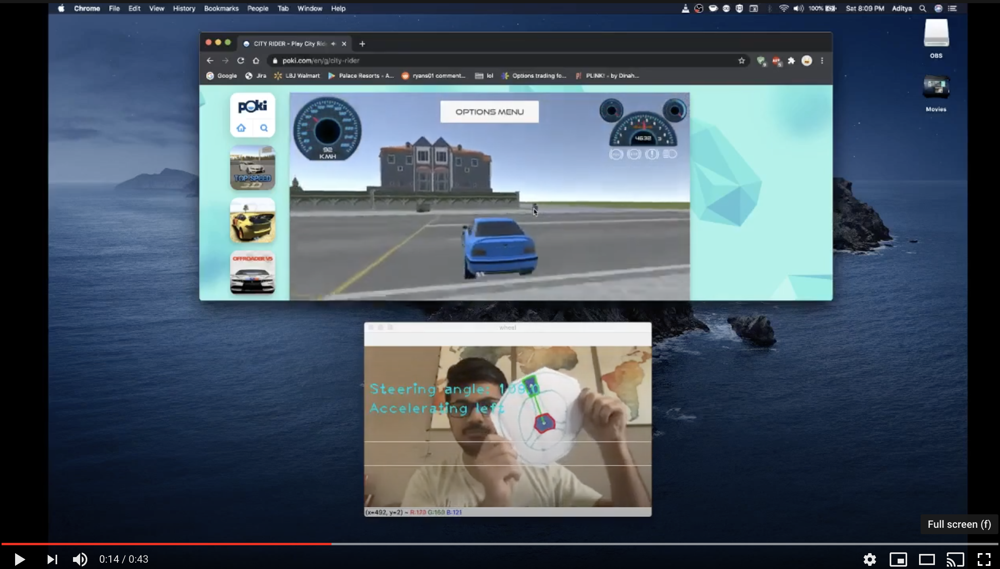

# Car controller for games using OpenCV

# Info
- Use OpenCV to detect contours and filters out the blue color on the steering wheel (See [Sample steering wheel](image.png))
- It then gets the slope of the line formed using the center of the wheel and the top of the wheel and uses that to determine the steering input
- Also, the position center of the wheel is responsible for braking and accelerating
- [Watch the video](https://youtu.be/TXieQvzbTD8)

# Usage (Requires python3):
1. `pip install -r requirements.txt`
2. `python main.py`
 
